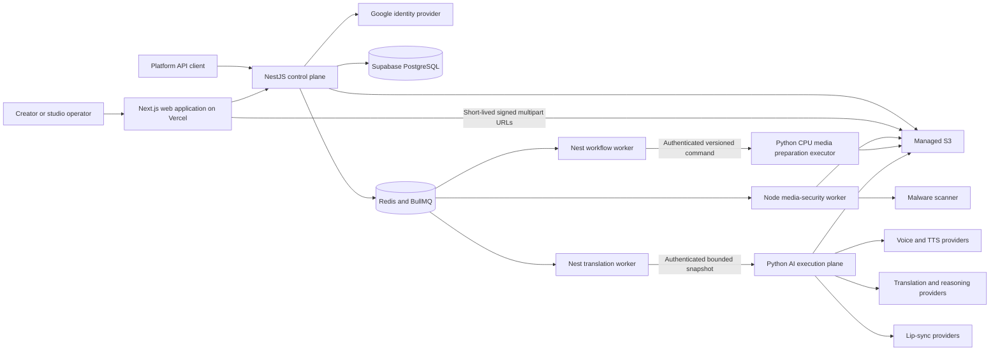
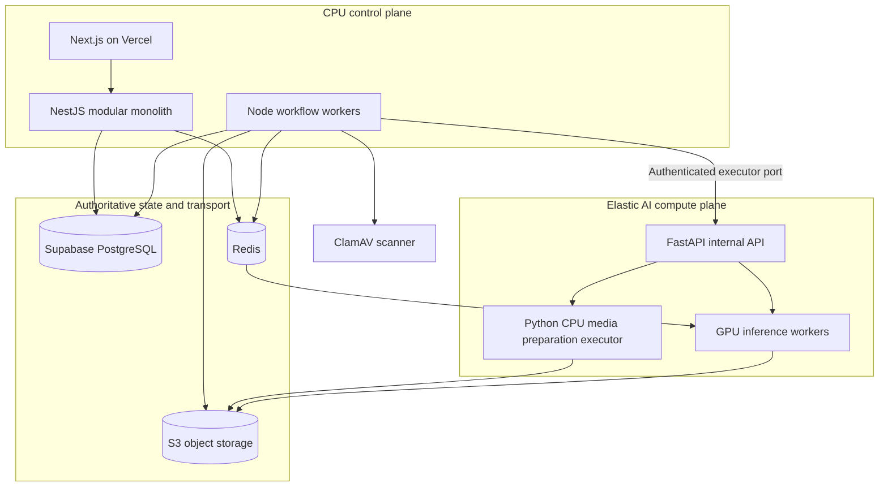
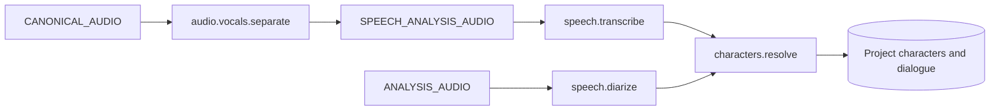
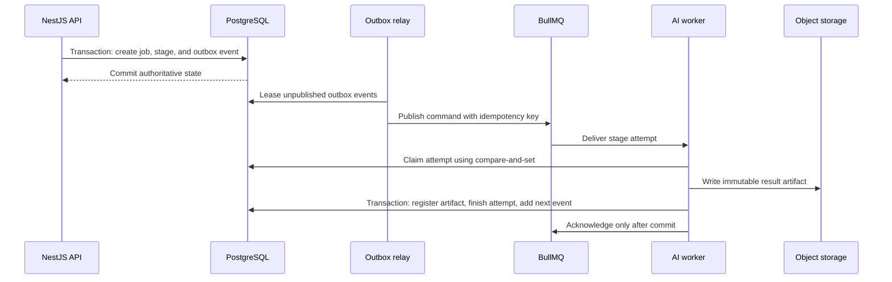

# VoiceVerse AI system architecture

## System context



## Deployment boundary

The initial system is a modular monolith with one justified service boundary:



NestJS owns tenant-aware business state, permissions, workflow policy, billing, audit, and public APIs. Python owns model execution and media/ML runtime concerns. Model providers never write business state directly.

Vercel and Supabase are not inference runtimes. Vercel hosts the Next.js web tier;
Supabase supplies browser identity and private PostgreSQL. Feature-length separation,
ASR, and diarization execute only on private container/GPU infrastructure, behind Nest
application ports. The Milestone 5 speech capabilities are disabled by default until
their exact images, models, quality thresholds, and license gates are approved.
Milestone 6 translation follows the same control/compute rule: Nest and PostgreSQL own
localization/editor/generation state, Python owns provider execution, and a real LLM
provider remains disabled until its privacy, legal, quality, cost, and operations gates
are approved.

## Secure ingest sequence

```mermaid
sequenceDiagram
    participant Browser
    participant API as NestJS API
    participant DB as PostgreSQL
    participant S3 as Private S3 bucket
    participant Relay as Outbox relay
    participant Queue as BullMQ
    participant Worker as Security worker
    participant Scanner as ClamAV

    Browser->>API: Create tenant-owned project and multipart upload
    API->>DB: Reject existing source; transaction guarded by unique project/video index
    API->>S3: CreateMultipartUpload using immutable object key
    API-->>Browser: Upload ID, part size, short-lived signing contract
    loop Bounded signing batches
        Browser->>API: Request signed part URLs
        API-->>Browser: Exact part URLs and content lengths
        Browser->>S3: PUT file parts directly
    end
    Browser->>API: Submit ordered ETag and size manifest
    API->>DB: Persist completion intent and immutable manifest
    API->>S3: CompleteMultipartUpload
    opt Provider response is ambiguous
        API->>S3: HEAD immutable object and reconcile size
    end
    API->>DB: Transaction: uploaded state and deduplicated outbox event
    Relay->>Queue: Publish scan command with idempotency key
    Queue->>Worker: At-least-once scan delivery
    Worker->>DB: CAS claim authoritative scan attempt with lease
    Worker->>S3: Stream quarantined object
    Worker->>Scanner: clamd INSTREAM frames
    loop While scan owns lease
        Worker->>DB: Heartbeat and extend lease
    end
    Scanner-->>Worker: Clean, infected, or stable error verdict
    Worker->>DB: Lease-guarded verdict, checksum, security state
    alt Permanent checksum or stream-limit failure
        Worker->>Queue: Acknowledge without Bull retry
    else Transient failure with budget
        Worker->>DB: Return same attempt/video to queued/pending
        Worker-->>Queue: Fail delivery for bounded retry
    end
```

Uploaded objects are never eligible for AI processing until the authoritative video
security state is `clean`. Browser checkpoints contain identifiers and completed-part
metadata only; credentials and file bytes are not persisted in web storage. The MVP
allows one immutable active/source video per project at both API and unique-index levels,
so a late scan from an older source generation cannot regress project status. Replacing
that constraint requires an explicit active source-revision/generation model, not merely
dropping the index.

If a published `media.scan.requested` event loses its BullMQ wake-up, the worker resets
the event to `PENDING` only after the stale-publication cooldown. An expired scan lease
can be reclaimed once under the same attempt; a second expiry closes scan and video in
error state. During Milestone 4 migration, historical `RUNNING` scans are converted to
immediately expired recoverable leases before lease constraints are validated. The
migration blocks with a descriptive remediation hint if any historical project still
has multiple videos; those sources must first be split into separate projects.

## Source-media preparation sequence

```mermaid
sequenceDiagram
    participant Security as Security worker
    participant DB as PostgreSQL
    participant Relay as Outbox relay
    participant Queue as BullMQ
    participant Worker as Nest workflow worker
    participant Executor as Python media executor
    participant S3 as Private object storage

    Security->>DB: Transaction: mark clean, create job/stage/attempt, add workflow.stage.execute event
    opt Eligible legacy CLEAN video has no v1 job
        Worker->>DB: Bounded transactional reconcile through idempotent initializer
    end
    Relay->>Queue: Publish command with authoritative attempt ID
    Queue->>Worker: At-least-once delivery
    Worker->>DB: CAS claim queued attempt or reclaim expired same attempt once
    Worker->>Executor: Authenticated v1 request with exact keys and configuration hash
    Executor->>S3: Read clean source once
    Executor->>Executor: Require MP4-family video + audio; bounded FFprobe validation
    Executor->>Executor: Produce channel-preserving and analysis FLAC
    Executor->>S3: Conditionally write audio, then manifest completeness marker
    Executor-->>Worker: Checksums, normalized metadata, producer and tool versions
    Worker->>Worker: Validate result identity, format, streams, and artifact set
    Worker->>S3: HEAD all exact outputs and verify full contract metadata
    Worker->>DB: Lease-guarded transaction: register artifacts/lineage and complete state
    Worker->>Queue: Acknowledge only after commit
```

The initial executor transport is hidden behind a Nest application port. Local Compose
uses HTTP only inside its development network; production worker configuration rejects
non-HTTPS media executor URLs and enabled speech executor URLs. PostgreSQL remains
authoritative throughout; the Python service cannot update business state. A future
Kubernetes Job adapter can replace the HTTP adapter without changing workflow domain
contracts. Python verifies source bytes and conditional output writes; Nest independently
HEADs the exact outputs and verifies size, media type, checksum, identity, configuration,
producer, and tool metadata before registration. The executor bearer is mounted only in
the worker and Python executor, never in the public API container.

If a published outbox command has no surviving BullMQ wake-up, the worker resets the
stale event to `PENDING` only after a cooldown and the relay republishes its deterministic
job ID. If a worker dies, the first expired lease reuses the same attempt/output
namespace for idempotent reconciliation. A second expiry exhausts that attempt's
recovery count, records `TIMED_OUT`, and enters the normal next-attempt retry path. A
heartbeat renewal wins through compare-and-set and prevents stale recovery. See
ADR-0009.

## Speech-analysis workflow

Milestone 5 creates a separate immutable `SPEECH_ANALYSIS` job after source preparation.
Its inputs are snapshots of the exact `CANONICAL_AUDIO` and `ANALYSIS_AUDIO` artifacts;
it never mutates the Milestone 4 derivatives.



Separation and diarization are independent root stages. Diarization uses the unchanged
analysis derivative so separator damage cannot erase speaker evidence. ASR waits for the
isolated-speech output, and character identification is a persisted fan-in that waits
for both normalized transcript and diarization results. PostgreSQL owns dependency
readiness; separate BullMQ queues provide at-least-once capability wake-ups.

Detailed model output is written as an immutable private manifest and then projected
into normalized timeline tables. Boundaries use integer microseconds and half-open
`[startUs, endUs)` intervals. Speaker clusters are scoped to one model run; public
character IDs are project-scoped and retain assignment evidence. No voice embedding or
unsupported age, gender, accent, personality, appearance, or relationship inference is
persisted in this milestone. Analysis stems are not delivery-quality soundtrack assets.
See [ADR-0010](adr/0010-speech-analysis-gpu-execution-and-character-memory.md) for the
GPU execution, model supply-chain, and character-memory boundary.

## Localization workflow

Milestone 6 opens one project localization workspace against the exact selected M5
analysis and one on-demand track per configured target language. The deterministic
`scene-bootstrap.v1` partition orders immutable M5 dialogue, starts scenes at a two-second
gap, 60-second span, or 200-line cap, and assigns one-based ordinals. It copies the exact
source text/timing into revision 1 without updating M5 evidence.

```mermaid
sequenceDiagram
    participant Editor as Authenticated editor
    participant API as NestJS API
    participant DB as PostgreSQL
    participant Worker as Nest translation worker
    participant Python as Python translation executor
    participant LLM as Approved LLM provider

    Editor->>API: POST target track / bootstrap workspace
    API->>DB: Serializable commit of M5-bound scenes, revisions, selections, track
    Editor->>API: POST generation with sceneId + idempotency key
    API->>DB: Resolve selected rows; store bounded immutable snapshots; queue generation
    Worker->>DB: Claim queued row with lease using SKIP LOCKED
    Worker->>Python: Authenticated request with execution ID and bounded snapshots
    Python->>LLM: Provider-neutral pinned prompt/model request
    LLM-->>Python: Bounded structured translations
    Python-->>Worker: Typed result with pinned execution/model identity
    Worker->>DB: Recheck selections; append target revisions; update draft pointers; succeed
```

PostgreSQL owns status, attempt budget, lease, idempotency, provenance, and the terminal
transaction; BullMQ may carry wake-ups but is not authoritative. Python and the model
provider receive no business-database credential and never write VoiceVerse state. Scene,
source, target, and glossary content is append-only; optimistic selection rows provide
current state and undo/redo. Public responses present rounded integer `startMs`/`endMs`,
while persistence and the compute contract retain integer microseconds.

Only selected content for one scene is disclosed: bounded dialogue, that scene's cultural
context, and a deterministic bounded target glossary. Source/translated text, glossary,
cultural context, prompts, snapshots, and raw provider payloads are forbidden in logs,
traces, metric labels, queue diagnostics, and audit metadata. See
[ADR-0011](adr/0011-nest-owned-localization-and-provider-neutral-translation.md).

M6 ends at reviewed translation text. TTS, voice cloning, emotion synthesis, lip sync,
subtitle/export layout, final mixing, and dubbed export remain later bounded deliveries.

## Initial bounded contexts

| Context                | Responsibilities                                                        | Initial implementation               |
| ---------------------- | ----------------------------------------------------------------------- | ------------------------------------ |
| Identity and access    | Users, organizations, memberships, sessions, API keys                   | NestJS module + PostgreSQL           |
| Project catalog        | Projects, source videos, language variants, metadata                    | NestJS module + PostgreSQL           |
| Media ingest           | Multipart uploads, validation, quarantine, artifact registration        | NestJS module + S3                   |
| Workflow               | Durable job/stage state, retries, cancellation, progress                | NestJS module + PostgreSQL + BullMQ  |
| Character memory       | Project identities and assignments; later profile/relationship evidence | NestJS + PostgreSQL M5 identity base |
| Localization           | Scenes, dialogue/translation revisions, context, editorial history      | M6 NestJS + PostgreSQL               |
| Voice production       | Voice profiles, consent, assignments, synthesis runs                    | NestJS module with AI/TTS adapters   |
| Rendering and delivery | Mixes, lip sync, exports, signed delivery                               | NestJS module with worker adapters   |
| Metering and billing   | Usage ledger, entitlements, invoices                                    | NestJS module + PostgreSQL           |
| AI execution           | M5 ASR/diarization and M6 translation; later emotion, TTS, and lip sync | Python ports; gated provider workers |

## Workflow reliability contract



Delivery is at least once. Correctness therefore comes from idempotency keys, database uniqueness constraints, immutable outputs, attempt leases, and transactional state transitions—not from assuming a queue message runs once.

## Data classification baseline

| Class        | Examples                                                    | Baseline controls                                                         |
| ------------ | ----------------------------------------------------------- | ------------------------------------------------------------------------- |
| Restricted   | Source media, cloned voice material, access/refresh tokens  | Encryption, least privilege, short-lived URLs, no application-log content |
| Confidential | Transcripts, translations, character profiles, billing data | Tenant authorization, encryption, audit access, retention policy          |
| Internal     | Job metadata, provider timings, trace data                  | Authenticated access and retention limits                                 |
| Public       | Product documentation and intentionally published exports   | Integrity controls and explicit publication state                         |

Production credentials are supplied through a managed secret store. Kubernetes Secrets alone are not treated as the system of record for secrets.
