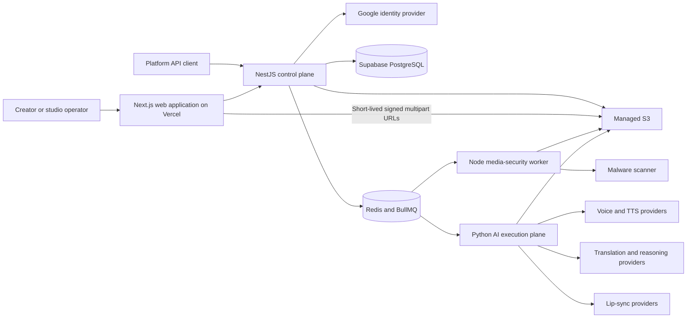
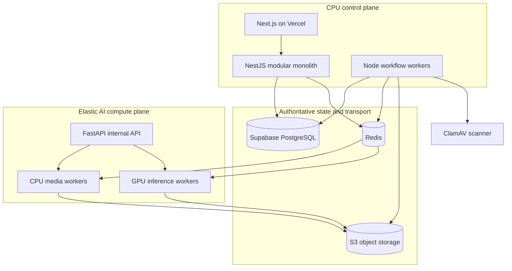
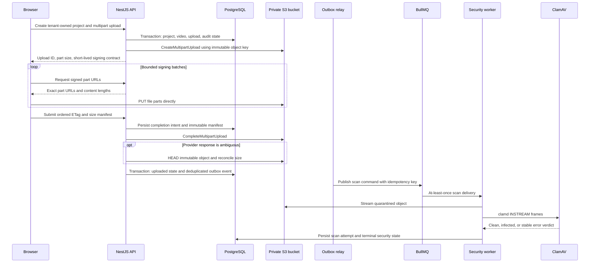
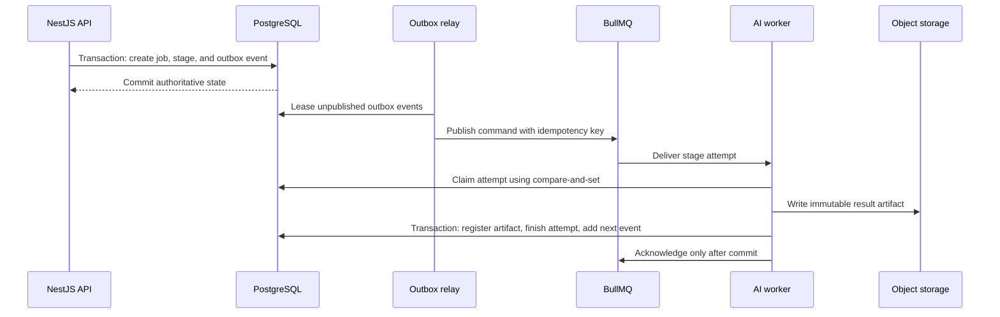

# VoiceVerse AI system architecture

## System context

## Deployment boundary

The initial system is a modular monolith with one justified service boundary:

NestJS owns tenant-aware business state, permissions, workflow policy, billing, audit, and public APIs. Python owns model execution and media/ML runtime concerns. Model providers never write business state directly.

## Secure ingest sequence

Uploaded objects are never eligible for AI processing until the authoritative video
security state is `clean`. Browser checkpoints contain identifiers and completed-part
metadata only; credentials and file bytes are not persisted in web storage.

## Initial bounded contexts

| Context                | Responsibilities                                                 | Initial implementation               |
| ---------------------- | ---------------------------------------------------------------- | ------------------------------------ |
| Identity and access    | Users, organizations, memberships, sessions, API keys            | NestJS module + PostgreSQL           |
| Project catalog        | Projects, source videos, language variants, metadata             | NestJS module + PostgreSQL           |
| Media ingest           | Multipart uploads, validation, quarantine, artifact registration | NestJS module + S3                   |
| Workflow               | Durable job/stage state, retries, cancellation, progress         | NestJS module + PostgreSQL + BullMQ  |
| Character memory       | Identity evidence, profile versions, relationships, assignments  | NestJS module + PostgreSQL           |
| Localization           | Scenes, segments, translation versions, subtitles                | NestJS module with AI provider ports |
| Voice production       | Voice profiles, consent, assignments, synthesis runs             | NestJS module with AI/TTS adapters   |
| Rendering and delivery | Mixes, lip sync, exports, signed delivery                        | NestJS module with worker adapters   |
| Metering and billing   | Usage ledger, entitlements, invoices                             | NestJS module + PostgreSQL           |
| AI execution           | ASR, diarization, emotion, translation, TTS, lip sync            | Python service and CPU/GPU workers   |

## Workflow reliability contract

Delivery is at least once. Correctness therefore comes from idempotency keys, database uniqueness constraints, immutable outputs, attempt leases, and transactional state transitions—not from assuming a queue message runs once.

## Data classification baseline

| Class        | Examples                                                    | Baseline controls                                                         |
| ------------ | ----------------------------------------------------------- | ------------------------------------------------------------------------- |
| Restricted   | Source media, cloned voice material, access/refresh tokens  | Encryption, least privilege, short-lived URLs, no application-log content |
| Confidential | Transcripts, translations, character profiles, billing data | Tenant authorization, encryption, audit access, retention policy          |
| Internal     | Job metadata, provider timings, trace data                  | Authenticated access and retention limits                                 |
| Public       | Product documentation and intentionally published exports   | Integrity controls and explicit publication state                         |

Production credentials are supplied through a managed secret store. Kubernetes Secrets alone are not treated as the system of record for secrets.
