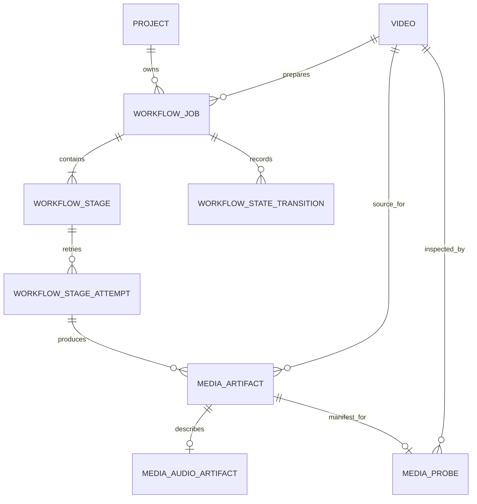

# Milestone 4: Durable workflow and source-media preparation

Status: **Repository implementation complete; deployment activation pending — July 17, 2026**

The forward-only schema, NestJS workflow control plane, authenticated Python media
executor, dashboard projection, containers, and repository quality gates are in place.
Applying the migration to the managed Supabase database, provisioning production
secrets and private network/storage policy, publishing images, and completing the
staging canary and representative load/failure-injection run remain deployment work.

This milestone begins only after the authoritative malware verdict is `CLEAN` and ends
after source inspection plus deterministic audio preparation. Vocal separation,
Whisper, Pyannote, character identification, scene understanding, translation, TTS,
lip sync, subtitles, and rendering are intentionally out of scope.

## Architecture decisions before implementation

| Decision                                                               | Reason and tradeoff                                                                                                                                                                                                                                                                                                   |
| ---------------------------------------------------------------------- | --------------------------------------------------------------------------------------------------------------------------------------------------------------------------------------------------------------------------------------------------------------------------------------------------------------------- |
| PostgreSQL is authoritative; BullMQ is transport                       | Queue delivery is fast and at least once, but Redis cannot be the only business record for a feature-film workflow. This adds database writes in exchange for replay safety, history, and supportability.                                                                                                             |
| Nest orchestrates; authenticated Python executes FFmpeg                | The control plane retains tenancy and workflow policy while native media dependencies scale independently. The initial internal HTTP request can be long-lived, so it is isolated behind a port; one bounded same-attempt lease recovery plus independent Nest object verification can reconcile an ambiguous result. |
| One `SOURCE_MEDIA_PREPARATION` stage has internal probe/extract phases | The executor downloads the source once and emits all three results. Coarse durable states are honest for v1; response streaming and richer phase progress are deferred rather than coupling persistence to an unstable transport.                                                                                     |
| Preserve a production master and create a separate analysis derivative | A 48 kHz channel-preserving FLAC avoids irreversible downmixing; a 16 kHz mono FLAC gives future speech models a stable input. The tradeoff is additional storage.                                                                                                                                                    |
| One immutable active/source `Video` per `Project` in the MVP           | Preventing competing source generations keeps late scan/workflow completions from regressing project status. The API rejects a second source before storage allocation and a unique database index closes races. Source replacement therefore requires a new project until an explicit revision model exists.         |
| Poll authoritative progress in v1                                      | Conditional polling is simple, resilient, and sufficient for coarse state. WebSocket notifications can later trigger a refetch without becoming a second source of truth.                                                                                                                                             |

ADR-0009 records the executor boundary and its migration path to Kubernetes Jobs.

## 1. Goal

Deliver the first durable processing slice:

```text
CLEAN source video
    -> durable preparation job
    -> bounded FFprobe validation
    -> PROBE_MANIFEST
    -> CANONICAL_AUDIO
    -> ANALYSIS_AUDIO
    -> authoritative completion state
```

The transformation contract is immutable and identified by pipeline version
`source-preparation-v1`.

Acceptance criteria:

- A clean scan transaction creates exactly one preparation job for the source and
  pipeline version, one ordered stage with key `source.media.prepare`, queued attempt
  number one, and one deduplicated outbox command for that attempt.
- A bounded worker reconciler creates the same idempotent graph for eligible
  `CLEAN`/`UPLOADED` videos with a persisted checksum that predate this workflow or
  missed initialization during deployment.
- Infected, errored, incomplete, unowned, or non-clean videos cannot enter media
  preparation.
- Malware scan attempts are database-leased and heartbeated. A lost scan wake-up is
  replayed from stale `media.scan.requested` outbox state, one expired lease may reclaim
  the same scan attempt, and recovery-budget exhaustion closes the scan/video in
  authoritative error state.
- Permanent scan content/policy failures are persisted once and acknowledged without a
  BullMQ retry; transient infrastructure failures retain the bounded transport retry.
- The MVP permits exactly one immutable source `Video` per `Project`, enforced before
  object-storage allocation and by a unique PostgreSQL index under concurrent requests.
- PostgreSQL records job, stage, attempt, transition, retry, error, and coarse progress
  state. BullMQ replay or loss cannot create a second authoritative success.
- The Python executor validates a real MP4-family container with at least one usable
  video stream and one audio stream rather than trusting the browser filename or
  declared MIME type.
- A server-computed SHA-256 is persisted before dispatch and verified while the executor
  reads the source. A missing optional browser checksum can never weaken this invariant.
- The selected audio stream and selection reason are persisted. Missing or unsupported
  audio fails with a stable, sanitized error code.
- A successful attempt registers immutable `PROBE_MANIFEST`, `CANONICAL_AUDIO`, and
  `ANALYSIS_AUDIO` artifacts with byte size, SHA-256, media metadata, producer version,
  configuration hash, and lineage to the clean source and producing attempt.
- Canonical audio is lossless 48 kHz FLAC and preserves every supported source channel
  and its layout. Unsupported layouts fail explicitly; they are never silently
  downmixed.
- Analysis audio is lossless 16 kHz mono FLAC with the same source timeline, ready for
  later ASR and diarization.
- Tenant-scoped API responses and the dashboard expose coarse
  `QUEUED`/`RUNNING`/`SUCCEEDED`/`FAILED` state without exposing object keys, service
  credentials, raw probe data, or internal errors.
- Lost BullMQ wake-ups are re-published from stale durable outbox state after a cooldown.
  Duplicate delivery, worker termination, timeout after object write, and partial
  output cannot attach corrupt or duplicate artifacts.
- The executor bearer credential is mounted only in the worker and Python executor;
  the public API container does not mount it, its validated configuration substitutes a
  non-secret sentinel, and it does not import the executor adapter.
- Metrics, traces, structured logs, liveness, and readiness cover the new worker and
  executor boundary.

## 2. Folder structure

```text
apps/api/src/modules/workflow/
  domain/                         states, invariants, ports, stable errors
  application/                    initialize, legacy reconcile, execute/recover, query
  infrastructure/                 Prisma, BullMQ, HTTP executor adapter
  presentation/                   tenant-scoped job query endpoints

apps/api/src/modules/workers/     outbox routing and workflow worker runtime
apps/api/src/modules/projects/    latest-job dashboard projection

services/ai/src/voiceverse_ai/
  api/media.py                    authenticated versioned execution endpoint
  media/                          probe, stream selection, FFmpeg, artifacts
  core/                           limits, service authentication, telemetry

apps/web/src/features/studio/     latest preparation state and progress

packages/database/prisma/models/
  workflow.prisma                 jobs, stages, attempts, transitions
  media-processing.prisma         artifacts and normalized media metadata

packages/database/prisma/migrations/
  20260717103000_durable_workflow_media_preparation/

docs/architecture/adr/0009-*.md  executor boundary and failure contract
```

Module names describe ownership. FFmpeg process details do not leak into the workflow
domain, and persistence/transport adapters remain replaceable through dependency
injection.

## 3. Database changes

Add normalized workflow records:

- `WorkflowJob`: organization, project, source video, job type, pipeline version,
  idempotency key, authoritative state, monotonic revision, timestamps, and sanitized
  terminal error. Overall progress is derived from persisted stage weights/progress;
  it is not stored as a competing job-level value.
- `WorkflowStage`: ordered stage definition and state. Milestone 4 creates exactly one
  `SOURCE_MEDIA_PREPARATION` stage with key `source.media.prepare`; the model still
  supports ordered stages in later pipelines.
- `WorkflowStageAttempt`: monotonically numbered attempts, worker/lease metadata,
  same-attempt recovery count, execution timing, stable outcome, configuration hash,
  executor version, and retry classification.
- `WorkflowStateTransition`: append-only entity/from/to/reason history and timestamp for
  operational audit and debugging. User/operator actions continue to use `AuditLog`.

Harden the authoritative predecessor state:

- extend `MalwareScanAttempt` with lease token/deadline, heartbeat, recovery count, and
  worker identity plus constraints that require complete lease state only while
  `RUNNING`;
- before those lease constraints are installed, backfill every historical `RUNNING`
  scan with its attempt ID as lease token, a synthetic worker marker, populated
  heartbeat/start timestamps, and an already-expired deadline so normal bounded
  recovery—not a fabricated verdict—takes ownership after rollout;
- index scan attempts by status/lease deadline and stale published
  `media.scan.requested` events by publication time; and
- replace the non-unique project/video listing index with `UNIQUE (project_id)` so a
  stale scan from a superseded source cannot start a competing workflow or overwrite
  current project status.

Add immutable media records for:

- common artifact identity, organization/project/video ownership, exact private object
  location, kind, MIME type, byte size, SHA-256, producer version, configuration hash,
  and producing attempt; the attempt's job supplies the pipeline version;
- `MediaProbe`, `MediaStream`, `MediaAudioStream`, `MediaVideoStream`, and
  `MediaTrackSelection` records for searchable normalized format, duration, selected
  stream, codecs, dimensions, rational frame rate, channel layout, and sample rate;
- `MediaAudioArtifact` metadata for the two lossless derivatives; and
- lineage from each output to the source video and producing attempt. The sanitized raw
  probe result is retained as the immutable `PROBE_MANIFEST`, not duplicated across
  operational rows.



Required constraints and indexes:

- one job per organization, source video, job type, and pipeline version;
- one stage key and sequence number per job;
- one attempt number per stage and valid state/timestamp combinations;
- progress constrained to `0..10000` basis points;
- globally unique immutable bucket/key and unique kind per successful producing
  attempt;
- SHA-256 stored as a fixed-length value, byte sizes and durations non-negative;
- an index for every foreign key;
- composite tenant/project/job-list indexes; and
- partial indexes for queued/running jobs, claimable or expired stage leases, legacy
  clean-video reconciliation, stale published workflow delivery recovery, and stale
  malware-scan delivery recovery.

UUIDs are application-generated UUIDv7 values and timestamps use `timestamptz`. The
migration adds workflow/media tables and scan lease columns, but deliberately tightens
project/source cardinality with a unique index; production rollout must preflight and
split every legacy source video into its own project before applying it. The migration
itself blocks before replacing the old project/video index and returns a descriptive
error plus that remediation hint if duplicates remain. Supabase Data API roles remain
denied; NestJS is the only business-data path.

## 4. APIs

Public, authenticated APIs:

- `GET /v1/projects/:projectId/jobs` — cursor-paginated jobs for an authorized project.
- `GET /v1/jobs/:jobId` — authoritative job, current stage, safe attempt summary,
  progress basis points, and a sanitized stable failure code.
- `GET /v1/projects` — extend each project summary with its latest preparation job.

The list/detail DTOs expose stable public enums and never expose storage locations,
executor payloads, stack traces, probe JSON, or credentials. Requests resolve the
organization from the authenticated internal principal and always scope lookups by
both tenant and resource identifier.

The dashboard polls the bounded project summary at a fixed interval only while an active
job exists and stops after a terminal result. The job-detail endpoint supports ETag/
`If-None-Match` revalidation. WebSocket notification, public cancel/retry mutations,
and artifact downloads are not part of this milestone.

Internal execution API:

- `POST /internal/v1/media-preparations` — bearer-authenticated, idempotent synchronous
  JSON command/result contract used only by the Nest executor adapter.

Its path and result schema are versioned independently from public APIs. The request
accepts an execution ID, the authoritative attempt ID, the persisted configuration
hash, a configured bucket, exact server-generated object keys, authoritative source
size/checksum, and an optional preferred audio language. The transformation profile
and resource limits remain server-owned configuration; the request does not accept
arbitrary URLs, filesystem paths, codecs, filters, deadlines, resource limits, or
FFmpeg arguments. Unknown request fields are rejected.

## 5. Frontend pages

Extend the existing authenticated studio dashboard rather than introduce the editor or
a new navigation hierarchy:

- show the latest preparation job beside each recent project;
- use accurate labels for waiting, preparing, prepared, and failed states rather than
  implying translation has begun;
- show a compact progress indicator for active work and stop polling at a terminal
  state;
- provide accessible text in addition to color, `aria` semantics for progress, and a
  safe failure label without rendering internal executor detail;
- preserve loading, empty, control-plane-down, keyboard, mobile, and dark-mode states;
  and
- link the summary to a job detail surface when that page is introduced.

No client computes workflow state from queue timing. The UI renders the authoritative
API projection, and sequential polling prevents overlapping refreshes.

## 6. Backend implementation

The clean verdict is itself durable. A scan delivery claims its pre-created database
attempt with a compare-and-set lease, changes the video to `SCANNING`, streams and
hashes the exact private object through ClamAV, and heartbeats the lease while running.
The verdict transaction is lease-token guarded. Only a clean verdict persists the
server-computed checksum and initializes source preparation; infected or error outcomes
cannot create a workflow.

The scan recovery loop uses the same stale-publication cooldown as workflow delivery.
It resets an eligible stale `media.scan.requested` outbox row to `PENDING` when a queued
wake-up was lost or a running lease expired, allowing deterministic BullMQ
republication. The first expired lease may be compare-and-set reclaimed under the same
scan-attempt ID and increments its recovery count. A second expiry records
`MEDIA_SCAN_LEASE_EXPIRED`, closes both attempt and video in error state, and audits the
failure. A concurrent heartbeat renewal defeats recovery. Transient ClamAV/storage
failures requeue the same authoritative scan attempt while BullMQ's bounded attempts
remain; permanent `SourceChecksumMismatch` and `ClamdStreamLimitExceeded` outcomes are
persisted as terminal errors and acknowledged so the feature-length source is not
downloaded repeatedly.

Source creation first checks that the owned project has no video, before allocating
provider multipart state. `UNIQUE (videos.project_id)` is the concurrency backstop; a
losing race best-effort aborts its provider upload and returns a conflict. This one-source
MVP invariant prevents an older scan or preparation generation from changing project
status after a newer generation became active.

The clean-scan transaction creates the versioned job, stage, queued attempt number one,
initial transitions, and a deduplicated `workflow.stage.execute` outbox event. The relay
publishes only the authoritative `attemptId`; the worker reloads tenant, security,
stage, job, and source state from PostgreSQL before it claims work.

A bounded `SourcePreparationReconciler` also scans oldest-first for legacy or stranded
videos that are `UPLOADED`, `CLEAN`, checksum-backed, and missing the
`source-preparation-v1` job. It rechecks every predicate inside the write transaction,
uses the same unique-keyed initializer, and emits an audit record. This backfills data
without a public-API side effect or a non-idempotent data migration.

The workflow worker:

1. claims the pre-created queued attempt with compare-and-set semantics and a lease
   token, or re-leases an expired `RUNNING` attempt in the same attempt/output namespace
   while its recovery count remains below the bounded limit;
2. for a fresh queued claim, moves the attempt, stage, and job to `RUNNING` and persists
   their transitions before execution; same-attempt recovery does not duplicate those
   transitions;
3. creates attempt-scoped immutable artifact keys and loads the expected source
   size/checksum;
4. invokes the `MediaPreparationExecutor` port through an HTTP adapter with a configured
   timeout, the attempt configuration hash, and automatic trace propagation when
   OpenTelemetry is enabled;
5. validates the authenticated versioned response, execution/attempt identity,
   authoritative source size/checksum, MP4-family format, required video stream,
   producer version, and complete three-kind artifact set;
6. independently HEADs each exact output key and requires response-matching byte size,
   media type, SHA-256 metadata, artifact kind, execution ID, attempt ID, configuration
   hash, producer name/version, and FFmpeg version; and
7. commits all three artifact records, normalized metadata, lineage,
   attempt/stage/job success, and audit data atomically before acknowledging BullMQ.

Python owns source-byte verification and the first output-write verification. It
computes each output's size and SHA-256, stamps the configuration hash and executor
producer version into object metadata, writes with `If-None-Match: *`, and on an
idempotent replay accepts an existing object only after its HEAD size and SHA-256
metadata match. The manifest is written last as the completeness marker. Nest then
performs the independent full-metadata HEAD verification above before any database
artifact can be registered. The attempt stores the returned executor version, and each
artifact stores that same producer version plus the persisted configuration hash.

Only legal state-machine transitions are accepted. Duplicate queue delivery observes
the current authoritative state and becomes a no-op. After a cooldown of at least 60
seconds and at least twice the outbox lease, the recovery loop resets a stale published
`workflow.stage.execute` event to `PENDING` when its queued wake-up was lost or its
running lease expired. The relay can then publish the same deterministic BullMQ job ID;
terminal transport rows are removed so durable replay is not blocked.

Heartbeats extend active leases. The first expired lease is compare-and-set reclaimed
under the same attempt ID, increments `recovery_count`, and reuses the immutable output
namespace so a prior ambiguous write can be verified and committed. If that recovered
attempt's lease expires again, it transitions to `TIMED_OUT`; the normal retry budget
then creates a later numbered attempt, new keys, and delayed outbox command. A heartbeat
that wins the race prevents either recovery transition. Other retryable failures follow
the later-attempt path directly. Stable executor error classes determine whether
automatic retry is allowed; user-facing messages remain sanitized.

Observability includes structured request and execution logs, automatic HTTP/database/
queue traces when enabled, active-attempt gauges, attempt outcome/runtime metrics,
registered output bytes, HTTP request metrics, health/readiness endpoints, and persisted
FFmpeg/FFprobe versions. Media, signed URLs, raw probe payloads, object keys, and
filenames are excluded from telemetry. Queue-wait, per-phase, executor-saturation, and
scratch-capacity metrics remain deployment-hardening improvements.

## 7. AI service

The FastAPI service adds a CPU media-preparation capability, not a model:

- authenticate the internal service request and validate its execution/attempt binding,
  persisted configuration hash, bucket/key constraints, authoritative source
  size/checksum, and optional preferred audio language;
- download the source once into private bounded scratch storage;
- run FFprobe with fixed fields, JSON-size limits, protocol restrictions, timeout, and
  process-tree cleanup;
- require an MP4-family container with at least one normalized video stream and one
  audio stream, rejecting audio-only MP4 and non-MP4 containers with stable errors;
- return all normalized streams and select audio deterministically by default
  disposition, then exact/base preferred-language match within that priority, then
  lowest absolute stream index, reporting
  `DEFAULT_THEN_LANGUAGE_THEN_LOWEST_INDEX` plus the specific selection reason;
- run FFmpeg without a shell to create a 48 kHz channel-preserving FLAC and 16 kHz mono
  FLAC while preserving the source timeline;
- calculate each local output's SHA-256 and byte size, conditionally upload the two
  audio artifacts, and upload the sanitized manifest last as the completeness marker;
- accept an already-present immutable object only when its size and SHA-256 metadata
  match, stamp identity/configuration/tool/producer metadata on every object, then
  return a synchronous versioned JSON result with the executor's producer version; and
- clean all scratch files on success, failure, timeout, or cancellation.

The executor never connects to PostgreSQL or Redis. It has no public business endpoint
and does not receive browser or Supabase tokens. Unsupported codecs/layouts, missing
video or audio, non-MP4 containers, corrupt inputs, timeouts, and resource limits map
to stable error codes.

Process startup validates resource configuration. Readiness validates that the
configured FFmpeg/FFprobe binaries are executable; liveness tests only process health
so a temporary object-storage outage does not create a restart loop.

## 8. Tests

Repository automated coverage includes:

- one-source-per-project API rejection before storage allocation and database unique-key
  race handling;
- clean/infected/transient/permanent malware outcomes, scan lease claim/heartbeat state,
  same-attempt expired-lease reclaim, stale `media.scan.requested` replay, terminal scan
  recovery, and clean-only workflow initialization;
- idempotent clean-scan initialization of the job, stage, first attempt, transitions,
  and `workflow.stage.execute` command;
- bounded legacy `CLEAN` video reconciliation with in-transaction eligibility recheck;
- workflow claim/success, server-generated keys, atomic artifact registration,
  stale published-outbox replay, same-attempt expired-lease recovery, exhausted recovery
  to `TIMED_OUT`/next attempt, heartbeat races, retry-to-new-attempt behavior, duplicate
  delivery, and executor response validation;
- fail-closed Nest HEAD verification for object size, media type, checksum, identity,
  configuration, producer, and tool metadata before artifact registration;
- internal API authentication/validation, stable errors, deterministic stream
  selection, MP4/video/audio enforcement, sanitized manifests, source size/checksum
  enforcement, configuration/producer metadata, resource limits, scratch cleanup,
  immutable-write replay, and subprocess timeout/process cleanup;
- role-specific configuration tests proving the real executor secret is required by the
  worker but replaced by a non-secret sentinel in the public API runtime;
- a real FFmpeg/FFprobe derivative smoke test when the binaries are available;
- dashboard response mapping, active-only polling, terminal-state presentation,
  accessible progress, desktop/mobile browser behavior, and control-plane failure
  states; and
- CI formatting, lint, strict type checking, unit/coverage tests, builds, browser tests,
  a fresh full PostgreSQL migration chain, and Compose configuration validation.

Deployment activation still requires production-shaped object-storage integration,
cross-tenant policy verification, worker-death/ambiguous-response chaos cases, a live
Supabase migration rehearsal, and representative feature-film load tests. Those are
release gates rather than unverified claims of repository completion.

## 9. Docker updates

- The AI image installs FFmpeg/FFprobe and persists the discovered tool versions with
  probe metadata; media binaries are not installed in the public API image. Production
  image publication must pin an immutable image digest and record its toolchain SBOM.
- Keep the media executor in the Python image and the orchestrator in the existing Nest
  worker image so they can be scaled independently.
- Compose runs the executor as non-root with a read-only root filesystem, dropped Linux
  capabilities, bounded process count, a small memory-backed `/tmp`, and a separate
  disk-backed private scratch volume.
- Production activation must add explicit ephemeral-storage requests, limits, and a
  scratch quota; the local named volume is intentionally only a development default.
- Add the internal executor URL, a high-entropy rotatable bearer credential, timeouts,
  scan/workflow lease durations, size/duration limits, and private storage configuration
  to validated environment configuration. The pipeline version/profile remains a
  code-owned configuration hash, and production secrets come from a secret store.
- Mount the executor bearer only into the worker and Python executor. The public API
  Compose service has no executor URL/credential variables, uses the API-specific
  configuration validator, and does not import the media-processing worker module.
- Make the FastAPI port private in production. Local Compose may bind it to loopback for
  development only.
- Add binary readiness, liveness, HTTP request metrics, and Nest workflow attempt/output
  metrics. Executor saturation and scratch-capacity metrics remain activation work.

Local images remain reproducible on the supported CPU architectures. Native binary
version changes require fixture/contract verification because codec output can change
even when command arguments do not.

## 10. Deployment

Deploy in a backward-compatible order:

1. preflight for projects with multiple source videos and split each historical source
   into its own project; then apply the forward-only PostgreSQL migration and verify the
   one-source unique index, immediately expired recovery leases backfilled for any
   historical `RUNNING` scans, and all remaining constraints/indexes on fresh and
   production-shaped databases;
2. deploy the authenticated Python media executor with no public ingress and validate
   its contract/readiness;
3. deploy the Nest worker with job creation disabled, then run a synthetic executor and
   object-store smoke test;
4. enable job creation for clean media, canary limited organizations, and observe queue
   age, scan/workflow lease recovery, permanent scan failure class, scratch use,
   checksum mismatch, and processing duration; and
5. deploy the web projection after API compatibility is confirmed.

Step 1 is a hard activation gate: worker rollout and job creation remain disabled until
the duplicate-source preflight passes, the migration completes, and the backfill and
constraints are verified.

Vercel continues to host only Next.js. Supabase PostgreSQL remains authoritative;
long-running media work does not run in Vercel or Supabase Edge Functions. Deploy the
Nest API/worker, Redis, private object storage, scanner, and Python executor as container
workloads.

In Kubernetes, give the executor separate CPU/memory/ephemeral-storage requests and
limits, a low bounded concurrency, topology-aware placement, private network policy,
and bucket/prefix-scoped source-read/artifact-write permissions. The static internal
bearer is an interim single-cluster control; use workload identity or mTLS before any
multi-cluster exposure. Scale from runnable-stage age, queue latency, and executor
saturation rather than public HTTP traffic. A future Kubernetes Job adapter replaces
the internal HTTP adapter through the existing execution port.

Rollback disables new preparation commands before rolling back worker/executor code;
already persisted jobs and artifacts remain readable. The forward-only schema changes
are retained until the compatibility and data-retention window closes.

## 11. Risks

- Long synchronous internal HTTP calls can end after successful writes. Exact
  attempt-scoped keys, one bounded same-attempt lease reclaim, Python conditional-write
  verification, and independent Nest HEAD verification allow safe reconciliation. If
  the same attempt cannot recover, it times out and a later attempt uses a fresh
  namespace; unreachable outputs still require lifecycle cleanup.
- Re-publishing stale `PUBLISHED` outbox rows trades a bounded duplicate-delivery window
  for liveness after Redis loss. The cooldown, deterministic BullMQ job ID, database
  claim CAS, recovery count, and terminal-state no-op keep that tradeoff controlled.
- The one-source-per-project invariant deliberately prevents replacement uploads,
  including after an aborted or failed first source. This is operationally restrictive,
  but simply allowing multiple videos would reintroduce stale scan/workflow completions
  that can regress project status or start work for the wrong generation.
- Feature-length MP4 files may require large seekable scratch space. Incorrect disk
  sizing can evict pods or stall a node, so concurrency and ephemeral storage must be
  planned together.
- Untrusted containers exercise native parsers. Pinned patched binaries, protocol
  restrictions, sandboxing, limits, and network isolation reduce but do not eliminate
  parser risk.
- Multiple audio tracks and ambiguous language/default metadata can lead to the wrong
  selection. Persist the policy and evidence so an operator can understand and later
  override it.
- FLAC supports common film channel layouts but not every immersive source. Fail closed
  rather than silently losing channels; richer layout handling is deferred.
- Canonical plus analysis FLAC increases storage and transfer cost. Lifecycle, orphan,
  and legal-hold policies must distinguish registered artifacts from partial outputs.
- FFmpeg output can vary by binary version, CPU feature, or flags. Producer and pipeline
  versions plus golden fixtures are required for reproducibility.
- Coarse progress can appear stationary during a long execution. It is intentionally
  more truthful than fabricated percentages, but needs clearer phase events later.
- Local Docker disk pressure can prevent representative image or feature-film tests;
  CI and staging must validate the complete container path.

## 12. Improvements

- Replace long-lived HTTP execution with a Kubernetes Job adapter and durable execution
  handles once workload duration and operational data justify it.
- Add cooperative cancellation plus authorized public cancel and retry APIs before
  exposing those controls in the dashboard; keep lease heartbeat/reaping under chaos
  coverage as the recovery baseline.
- Replace the one-source MVP constraint only with an explicit immutable source-revision
  model: an active revision pointer/generation token on the project, generation-guarded
  status updates, cancellation or supersession of old scan/workflow attempts, and a
  migration that backfills every existing source. Do not merely drop the unique index.
- Add periodic full-object checksum audits and lifecycle cleanup for unreachable attempt
  namespaces; the synchronous Nest check intentionally verifies authoritative HEAD
  metadata rather than downloading feature-length outputs again.
- Add versioned phase events or WebSocket notifications that trigger authoritative API
  refetches; never make the socket the workflow record.
- Add queue-wait, FFprobe/FFmpeg phase, executor-saturation, and scratch-capacity
  metrics before production autoscaling depends on them.
- Support operator-confirmed audio-stream selection, richer immersive/channel-object
  metadata, and lossless passthrough where codec and policy permit it.
- Add artifact reachability analysis, legal holds, orphan cleanup, retention tiers, and
  checksum audit jobs.
- Add content-addressed stage caching keyed by source checksum, stream choice, pipeline
  version, FFmpeg version, and transformation profile.
- Add dedicated CPU pools, priority/fairness controls, and per-organization concurrency
  quotas from measured demand.
- Begin Milestone 5 with vocal separation, Whisper ASR, Pyannote diarization, timed
  segments, and initial character identity evidence on top of the analysis artifact.
