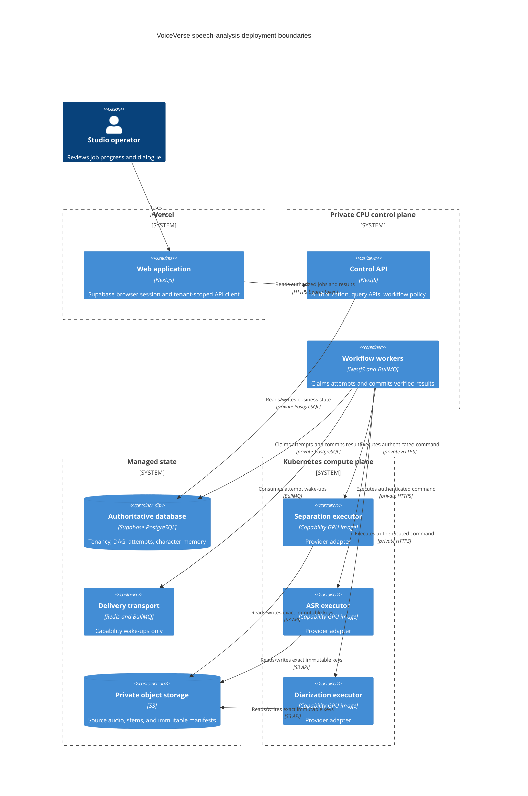
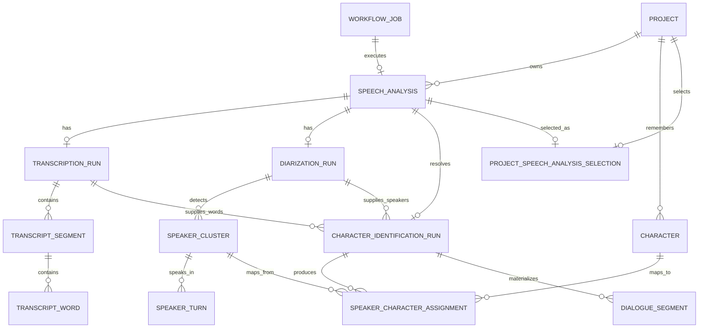

# Milestone 5: Speech analysis and character identification

Status: **Repository foundation implemented; production activation gated — July 17, 2026**

Milestone 5 adds the durable workflow, normalized data model, provider-neutral execution
contracts, read-only result APIs, and studio result surfaces for vocal separation,
transcription, speaker diarization, and deterministic character identification. The
top-level feature flag and every Python speech capability are disabled by default.
Repository tests use injected deterministic providers; no heavyweight separation,
Whisper, Pyannote, Torch, CUDA, or model-weight dependency is bundled in the base image.

The control-plane foundation now gates speech-consumer creation on an exact readiness
handshake for all three remote capabilities and repeats the capability-specific handshake
before each remote delivery is claimed. It distinguishes pre-provider HTTP 429 capacity
pressure from a semantic model failure, aborts executor HTTP when lease ownership is lost,
and never reuses an expired running attempt's immutable output namespace.

Production processing is therefore not activated merely by deploying this repository.
Each capability still needs a pinned model and runtime, a dedicated GPU image, quality
and load approval on representative licensed media, security review, and license/legal
approval. This milestone does **not** translate dialogue, generate or clone voices,
detect emotion, lip-sync video, generate subtitles, alter on-screen text, render regional
thumbnails, or export a dubbed movie.

## Architecture decisions before implementation

| Decision                                                                   | Reason and tradeoff                                                                                                                                                                                                                                                                                           |
| -------------------------------------------------------------------------- | ------------------------------------------------------------------------------------------------------------------------------------------------------------------------------------------------------------------------------------------------------------------------------------------------------------- |
| Create an immutable `SPEECH_ANALYSIS` job after source preparation         | Media preparation remains a stable CPU boundary and can be retried or upgraded independently. A second job adds state, but avoids coupling model changes to the source-media contract.                                                                                                                        |
| Keep PostgreSQL authoritative and use BullMQ only for wake-ups             | A feature-film workflow must survive duplicate, delayed, or lost queue delivery. Transactional stage dependencies and attempts cost more database writes in exchange for deterministic recovery and an auditable history.                                                                                     |
| Gate remote work on an exact serving-model handshake                       | Consumers start only when every remote capability serves its configured descriptor, and each remote delivery repeats the check before claiming its durable lease. This adds a small preflight request but prevents unavailable or drifted executors from consuming a semantic attempt.                        |
| Separate capacity deferral from semantic retry                             | The executor's HTTP 429 is emitted before provider execution, so the same attempt and outbox identity can be returned to `RETRY_WAIT` with bounded backoff. Other failures and expired running leases allocate a new attempt/output namespace, avoiding ambiguous reuse after work may have started.          |
| Run vocal separation and diarization in parallel                           | Diarization reads the unchanged 16 kHz `ANALYSIS_AUDIO`, because source separation can distort quiet or overlapping speech. Separation reads `CANONICAL_AUDIO`; ASR waits for its isolated speech derivative. This reduces the critical path without making diarization depend on a lossy model output.       |
| Fan in character identification after ASR and diarization                  | Resolution consumes both normalized transcript and diarization evidence, including valid empty or unaligned results. Persisted dependencies prevent a queue-order race, while detected speaker clusters still become characters when no ASR words align.                                                      |
| Store timeline boundaries as integer microseconds with half-open intervals | `[startUs, endUs)` avoids floating-point drift and makes adjacent segments non-overlapping by definition. It uses larger values and requires explicit millisecond conversion at the public API boundary.                                                                                                      |
| Separate immutable manifests from normalized query projections             | Full provider output is immutably stored and checksum-verified in private object storage, while PostgreSQL stores the tenant-scoped entities needed by product queries. This duplicates selected data intentionally so model evidence remains reproducible without forcing the UI to parse large JSON blobs.  |
| Make characters project-scoped and speaker clusters run-scoped             | A provider label is not a character identity. Each analysis maps temporary speaker clusters to persistent project character IDs, allowing the whole movie to reference one character record. Cross-source and cross-project identity are deliberately not inferred.                                           |
| Persist only supported identity evidence                                   | M5 stores assignment method, confidence, timing, and speaking statistics. It does not guess age, gender, accent, personality, appearance, or relationships, and it does not persist voice embeddings. Those fields require versioned evidence, provenance, consent, and review policies in a later milestone. |
| Hide model implementations behind capability ports                         | Control-plane and manifest contracts remain stable while separation, ASR, and diarization providers can change. Separate capability images cost more operationally but isolate incompatible CUDA stacks, scaling behavior, licenses, and failure domains.                                                     |

[ADR-0010](../architecture/adr/0010-speech-analysis-gpu-execution-and-character-memory.md)
records the durable DAG, GPU execution, model supply-chain, and character-memory
boundaries.

## 1. Goal

Turn the two immutable Milestone 4 audio derivatives into a queryable, reproducible
source-dialogue analysis:

```text
CANONICAL_AUDIO ----> vocal separation ----> analysis vocal/accompaniment stems
                                  |
                                  +---------> isolated speech ----> transcription ----+
                                                                                      |
ANALYSIS_AUDIO -----> speaker diarization --------------------------------------------+
                                                                                      |
                                                                 character resolution
                                                                       |
                                                    characters + dialogue segments
```

The stems in this milestone are **analysis aids**, not delivery-quality soundtrack
assets. The untouched canonical master remains the basis for a future professional mix;
M5 never replaces music or sound effects in an exported movie.

Acceptance criteria for the repository foundation:

- exactly one versioned speech-analysis job is initialized per source video and pipeline
  version, with immutable references to the canonical and analysis inputs;
- the complete four-stage dependency graph is persisted before queue publication;
- separation and diarization start independently, transcription unlocks only after
  separation, and character identification unlocks only after transcription and
  diarization;
- each queued attempt carries only its authoritative attempt ID; workers reload tenant,
  source, configuration, and input state from PostgreSQL;
- remote consumers are created only after all three exact readiness handshakes pass, and
  every remote delivery repeats its capability handshake before a durable lease is claimed;
- pre-provider HTTP 429 capacity pressure defers the same attempt with bounded backoff and
  without incrementing its semantic attempt number; an expired running lease becomes
  `TIMED_OUT` and retries under a new attempt ID and output prefix;
- loss of heartbeat lease ownership aborts the in-flight executor HTTP request, while
  lease-token compare-and-set still guards every completion;
- executor commands use server-generated object keys, configured buckets, bounded
  inputs, stable errors, and authenticated internal endpoints;
- detailed transcript and diarization results are immutable private manifests, while
  normalized runs, segments, words, speakers, turns, assignments, and dialogue are
  persisted for tenant-scoped queries;
- Nest streams each manifest through declared-size and configured byte caps, verifies its
  digest and immutable execution/input envelope, and then strictly validates the bounded
  JSON before an atomic relational projection;
- every executor artifact verifies `contract-version` and `input-sha256` provenance;
  separation additionally requires vocal/accompaniment stems to preserve canonical sample
  rate and channels while isolated speech remains 16 kHz mono;
- overlapping and exclusive diarization timelines are preserved; every interval uses
  the source clock and the half-open microsecond convention;
- a no-speech source succeeds with zero speakers and zero dialogue rather than producing
  a fabricated failure;
- run-local provider labels never appear in public character or dialogue contracts;
- the job page distinguishes pending, available, and unavailable results and polls only
  while the authoritative workflow is active; active/failed job reads do not scan
  transcript aggregates that cannot yet be shown; and
- keeping all feature flags off leaves Milestone 4 upload and media preparation behavior
  unchanged.

### Container view



Text alternative: the browser is hosted on Vercel and calls only the NestJS API.
Supabase supplies browser identity and private PostgreSQL, but the browser does not read
business tables through the Data API. Nest workers own durable state transitions and
call private, capability-specific Kubernetes executors. Executors can access only the
configured object bucket and never write business state.

## 2. Folder structure

```text
apps/api/src/modules/speech-analysis/
  domain/                         stage definitions and executor ports
  application/                    initializer, reconciler, DAG coordinator,
                                  readiness policy, timeline materializer and queries
  infrastructure/                 abortable HTTP adapters, bounded streaming
                                  manifest reader, capability queue names
  presentation/                   tenant-scoped character/dialogue result DTOs
                                  and endpoints; job GET stays in workflow

apps/api/src/modules/workers/     outbox routing and bounded capability consumers
apps/web/src/app/jobs/[jobId]/    read-only job result route
apps/web/src/features/studio/     job stages, character summary, dialogue preview

services/ai/src/voiceverse_ai/
  api/speech.py                   authenticated versioned internal endpoints
  speech/models.py                strict command, manifest, and response contracts
  speech/providers.py             injected provider protocols
  speech/service.py               bounded workspace, storage, concurrency, cleanup

packages/database/prisma/models/
  workflow.prisma                 dependencies, input snapshots, blocked stages
  media-processing.prisma         analysis artifacts and tenant-safe lineage
  speech-analysis.prisma          normalized runs, timelines, and character memory

packages/database/prisma/migrations/
  ..._m5_speech_analysis_enum_extensions/ enum-only predecessor
  ..._m5_speech_analysis_foundation/      transactional tables and constraints

docs/architecture/adr/
  0010-speech-analysis-gpu-execution-and-character-memory.md
```

The Nest module owns tenancy, workflow policy, and product projections. Python owns
model runtime and artifact production. Neither provider code nor provider labels leak
into the public application layer.

## 3. Database changes

### Workflow and artifact foundation

- add `SPEECH_ANALYSIS` plus vocal-separation, speech-recognition,
  speaker-diarization, and character-identification stage kinds;
- add `BLOCKED` to the stage state machine and make `readyAt` nullable;
- store immutable stage configuration JSON and its SHA-256 hash;
- add `WorkflowStageDependency` so readiness is a database fact rather than an inferred
  queue order;
- add `WorkflowJobArtifactInput` to snapshot the exact `CANONICAL_AUDIO` and
  `ANALYSIS_AUDIO` artifacts selected at job creation;
- add the separation stems, isolated speech, transcript, diarization, and character
  manifest artifact kinds; and
- strengthen artifact lineage with composite organization, project, and source-video
  foreign keys so a cross-tenant or cross-project lineage edge is impossible even if
  application validation regresses.

PostgreSQL enum additions are deployed in a separate forward migration before tables or
constraints use them. This avoids relying on a newly added enum value inside the same
transaction that introduced it.

### Normalized analysis model

- `SpeechAnalysis` binds one immutable workflow run to its tenant, project, source video,
  and source language.
- `TranscriptionRun`, `TranscriptSegment`, and `TranscriptWord` record provider/model
  provenance, ordered text, confidence, and source-clock word timing.
- `DiarizationRun`, `SpeakerCluster`, and `SpeakerTurn` preserve normal and exclusive
  speaker timelines, overlap evidence, and provider provenance.
- `Character` is the persistent, project-scoped identity. A run-local cluster cannot be
  used as a public character ID.
- `CharacterIdentificationRun` binds the exact ASR and diarization runs used by the
  deterministic resolver.
- `SpeakerCharacterAssignment` records the cluster-to-character mapping, assignment
  method, confidence, first appearance, speaking duration, segment count, and word count.
- `DialogueSegment` materializes ordered transcript spans with an optional character
  assignment while retaining links to the contributing transcript segment and speaker
  turn.
- `ProjectSpeechAnalysisSelection` identifies the analysis revision selected for product
  reads without overwriting older evidence.



Text alternative: a project owns versioned speech analyses and long-lived characters.
Each analysis has at most one transcription run, diarization run, and character
identification run. The identification run joins the exact transcription and
diarization evidence, maps each run-local speaker cluster to a project character, and
materializes ordered dialogue. The project selection points to the analysis revision
currently shown to product users.

Every foreign key used for tenant-owned data is indexed. Cursor paths use compound
indexes ending in the entity ID, confidence values use basis points, and timeline and
duration values use non-negative `BIGINT` microseconds. Check constraints enforce
`end_time_us > start_time_us`, valid basis-point ranges, mutually valid workflow
timestamps, and input/lineage tenant consistency. Supabase `anon`, `authenticated`, and
`service_role` Data API privileges remain revoked for business tables; NestJS is the
only business-data path.

## 4. APIs

Public authenticated APIs:

- `GET /v1/jobs/:jobId` — tenant-scoped job, project header, stages, progress, safe
  failure code, transcript summary, and character summary;
- `GET /v1/jobs/:jobId/characters?limit=&cursor=` — keyset-paginated project character
  assignments committed by that immutable job; and
- `GET /v1/jobs/:jobId/dialogue-segments?limit=&cursor=` — keyset-paginated source
  dialogue with public character identity when assigned.

Result collections expose `PENDING`, `AVAILABLE`, or `UNAVAILABLE` independently. A zero
count is therefore distinguishable from a result that has not been produced. Cursors
bind to the job's analysis and identification run, so a stale cursor cannot splice two
runs into one page; changing the project default does not hide historical job results.
Public DTOs convert microseconds to safe integer milliseconds and never expose
storage keys, internal executor URLs, raw manifests, provider speaker labels, secrets,
stack traces, or unbounded provider error text.

Internal, bearer-authenticated APIs:

- `GET /internal/v1/speech-capabilities/{capability}` — authenticated readiness
  handshake returning the model descriptor currently served by that capability;
- `POST /internal/v1/vocal-separations`;
- `POST /internal/v1/transcriptions`; and
- `POST /internal/v1/speaker-diarizations`.

Internal requests identify a configured bucket, immutable input artifact, input digest,
attempt/execution IDs, configuration hash, and server-generated output keys. Every POST
also carries the immutable stage's `expectedModel` descriptor: provider, model ID, model
revision, and runtime version. The executor rejects a serving-descriptor mismatch; callers
cannot select a different model, arbitrary URL, filesystem path, device, resource limit,
or command-line argument. Responses are compact integrity summaries; feature-length
details remain in bounded, checksum-verified private manifests.

The worker uses the readiness GET both before creating the remote queue consumers and as
a capability-specific preflight before claiming each remote delivery. The FastAPI
concurrency limiter returns HTTP 429 before creating a workspace or invoking a provider.
Nest maps only that trusted status to `SPEECH_EXECUTOR_SATURATED`; it can requeue the same
attempt and outbox event up to 12 times with 15–240 second bounded exponential delays.
When that bound is exhausted, normal retry policy applies and therefore consumes a new
semantic attempt if budget remains.

## 5. Frontend pages

Add a read-only authenticated route at `/jobs/[jobId]`; each studio project links to its
latest workflow job. The page provides:

- the authoritative job and stage list with text labels in addition to color;
- progress that remains understandable to assistive technology;
- transcript duration and segment count without implying that translation exists;
- character cards with first appearance, speaking duration, and segment count;
- a cursor-paginated dialogue preview showing start time, character assignment, and
  source text. The API also carries end time, source language, and confidence for later
  editor work, but the current preview does not render those fields;
- explicit pending, unavailable, zero-result, loading, stale, control-plane-down, and
  unknown-enum fallbacks;
- desktop tables and mobile articles that preserve the same information order; and
- polling only while the job is active, with stale-but-visible data retained during a
  transient refresh failure. Active and terminal-unsuccessful job responses derive result
  availability from workflow status and skip feature-length transcript/character aggregate
  queries; aggregates run only after successful completion.

This page is not the timeline editor. Rewrite, regenerate, merge/split character, change
voice, undo/redo, audio preview, subtitle editing, and translation controls are later
milestones.

## 6. Backend implementation

The initializer creates the entire `speech-analysis.v1` graph in one transaction. It
snapshots both M4 inputs, writes four stages and their configuration hashes, records
dependencies and state transitions, creates first attempts only for ready root stages,
and emits deduplicated outbox events. A bounded reconciler creates the same graph for
eligible source-preparation jobs that succeeded before the feature was enabled.

```mermaid
sequenceDiagram
    participant M4 as Source preparation
    participant DB as PostgreSQL
    participant Relay as Outbox relay
    participant SepQ as Separation queue
    participant DiaQ as Diarization queue
    participant AsrQ as ASR queue
    participant SpeechW as Nest speech worker
    participant Sep as Separation executor
    participant Dia as Diarization executor
    participant Asr as ASR executor
    participant CharQ as Character queue
    participant CharW as Nest character worker
    participant S3 as Private S3

    M4->>DB: Transaction: create immutable SPEECH_ANALYSIS DAG
    Note over DB: separation + diarization QUEUED<br/>ASR + character resolution BLOCKED
    Note over SpeechW,Asr: Remote consumers start only after all three exact readiness handshakes pass
    par Independent root stage
        Relay->>SepQ: Publish separation attempt ID
        SepQ->>SpeechW: Deliver attempt ID
        SpeechW->>Sep: GET exact capability/model readiness
        Sep-->>SpeechW: Serving descriptor matches configuration
        SpeechW->>DB: Claim attempt and reload authoritative inputs
        SpeechW->>Sep: Authenticated exact-key command
        Sep->>S3: Read canonical audio; write stems and manifest
        Sep-->>SpeechW: Compact artifact integrity summary
        SpeechW->>S3: HEAD/read exact outputs and verify checksums
        SpeechW->>DB: Atomic register, complete, unlock ASR, add outbox
        Relay->>AsrQ: Publish unlocked ASR attempt ID
        AsrQ->>SpeechW: Deliver attempt ID
        SpeechW->>Asr: GET exact capability/model readiness
        Asr-->>SpeechW: Serving descriptor matches configuration
        SpeechW->>DB: Claim attempt and reload isolated-speech input
        SpeechW->>Asr: Authenticated exact-key command
        Asr->>S3: Read isolated speech; write transcript manifest
        Asr-->>SpeechW: Compact artifact integrity summary
        SpeechW->>S3: HEAD/read and verify transcript manifest
        SpeechW->>DB: Atomic normalize transcript and complete stage
    and Independent root stage
        Relay->>DiaQ: Publish diarization attempt ID
        DiaQ->>SpeechW: Deliver attempt ID
        SpeechW->>Dia: GET exact capability/model readiness
        Dia-->>SpeechW: Serving descriptor matches configuration
        SpeechW->>DB: Claim attempt and reload authoritative input
        SpeechW->>Dia: Authenticated exact-key command
        Dia->>S3: Read analysis audio; write diarization manifest
        Dia-->>SpeechW: Compact artifact integrity summary
        SpeechW->>S3: HEAD/read and verify diarization manifest
        SpeechW->>DB: Atomic normalize speaker turns and complete stage
    end
    Note over DB: character stage unlocks only after ASR and diarization succeed
    Relay->>CharQ: Publish character attempt ID from committed outbox
    CharQ->>CharW: Deliver attempt ID
    CharW->>DB: Claim and load normalized ASR + diarization evidence
    CharW->>S3: Write and verify immutable character manifest
    CharW->>DB: Atomic persist results, complete job, select revision
```

Text alternative: source preparation persists the whole graph. Separation and
diarization outbox events are relayed independently to capability queues. Remote
consumers are not created until all exact readiness handshakes pass; each remote delivery
also verifies its capability descriptor before Nest claims the PostgreSQL attempt. Nest
then calls Python, verifies exact S3 outputs, and commits normalized results. Successful
separation commits an ASR outbox event. After both ASR and diarization commit, the outbox
relay publishes character resolution. The Nest CPU worker commits its manifest and query
model, completes the job, and selects the analysis revision; Python executors never write
business state or publish queues.

Workers use compare-and-set claims, leases, heartbeats, attempt budgets, immutable attempt
output namespaces, and lease-token-guarded completion. A heartbeat compare-and-set that
proves lease ownership was lost aborts the remote HTTP request. Recovery marks an expired
running attempt `TIMED_OUT`; if retry budget remains, it creates a new attempt ID,
idempotency key, outbox event, and output prefix. It never reclaims possibly executed work
under the expired namespace.

HTTP 429 is the narrow exception because the executor limiter emits it before workspace
creation or provider execution. The coordinator returns that same attempt and its existing
outbox identity to delayed delivery, increments a bounded capacity-deferral counter, and
does not change `attemptNumber`. After 12 deferrals, it falls through to the ordinary
retry/terminal-failure policy instead of hiding a broken or permanently undersized
deployment.

Stage completion locks the job while checking dependencies, so parallel predecessor
commits cannot double-unlock a dependent stage. Terminal failure closes the job and
cancels unreachable blocked descendants; any other transient, retryable failure creates
the next attempt without changing the stage configuration snapshot.

The character resolver assigns each timed word to the maximum-overlap exclusive speaker
turn, uses a bounded nearest-turn fallback when necessary, and leaves unsupported words
unassigned. It creates deterministic movie-local character keys ordered by first
appearance, retains overlap evidence, and calculates speaking statistics from committed
dialogue. Character-order statistics are accumulated in one linear pass over the selected
speaker turns, followed by an `O(s log s)` stable sort of the `s` speaker clusters; ordering
does not rescan every turn for every speaker. Provider labels remain internal run evidence
rather than stable product IDs.

## 7. AI service

The Python foundation supplies strict provider protocols and the authenticated execution
envelope. Its ASGI guard authenticates internal speech routes before reading request bodies
and caps both declared and chunked POST bodies. The service verifies the configured bucket
and input digest, owns bounded scratch directories and concurrency, rejects symlink or
non-regular outputs, independently decodes and validates generated FLAC metadata, writes
outputs conditionally to immutable keys, emits a manifest only after every required
artifact exists, returns stable sanitized errors, and cleans its workspace. Disabled or
unconfigured capabilities fail closed and are not ready.

The in-process limiter rejects excess work with HTTP 429 before workspace creation,
input download, or provider invocation. Every uploaded speech artifact is stamped with
the contract version and authoritative input SHA-256 in addition to attempt, execution,
configuration, producer, and model identity. Nest independently HEADs those immutable
objects, verifies that provenance, enforces canonical channel/sample-rate preservation for
the two analysis stems and 16 kHz mono for isolated speech, then streams each manifest
through the configured byte ceiling and declared-size/digest checks before strict parsing.
The bounded manifest is currently materialized in memory for schema validation and one
atomic relational projection; it is not an incremental JSON parser.

The following are candidates, not bundled or activated production defaults:

| Capability          | Candidate and activation gate                                                                                                                                                                                                                                                                                                                                                                                                                                                                                                                                                     |
| ------------------- | --------------------------------------------------------------------------------------------------------------------------------------------------------------------------------------------------------------------------------------------------------------------------------------------------------------------------------------------------------------------------------------------------------------------------------------------------------------------------------------------------------------------------------------------------------------------------------- |
| Speech recognition  | [Faster-Whisper](https://github.com/SYSTRAN/faster-whisper) is a CTranslate2 implementation of the [OpenAI Whisper](https://github.com/openai/whisper) model family and supports word timestamps. Pin the package, CTranslate2 runtime, converted weight digest, and model revision; build a CUDA-compatible image; benchmark multilingual WER, code switching, hallucination/no-speech behavior, timing, throughput, and VRAM; then obtain legal and security approval.                                                                                                          |
| Speaker diarization | [pyannote.audio](https://github.com/pyannote/pyannote-audio) with [`speaker-diarization-community-1`](https://huggingface.co/pyannote/speaker-diarization-community-1) is the candidate. Its model card requires accepting access/contact conditions and identifies the pipeline license as CC-BY-4.0; company counsel must review the exact pinned snapshot and intended commercial use. Provision that snapshot offline, disable optional telemetry, and benchmark DER, speaker count, overlap, quiet dialogue, language/genre cohorts, throughput, and VRAM before activation. |
| Vocal separation    | The provider remains undecided. The original [Meta Demucs repository](https://github.com/facebookresearch/demucs) is archived and points to a fork that is not actively developed, so VoiceVerse will not silently make it a production dependency. Select a maintained runtime and exact weight set only after code, model, and training-data license review plus stem-bleed, dialogue-damage, music/SFX preservation, latency, and memory benchmarks.                                                                                                                           |

Model artifacts must be resolved during a controlled build or provisioning job, scanned,
hashed, added to the software/model bill of materials, and mounted read-only. Production
requests and readiness probes must not download models or require a Hugging Face token.
Capability images should run one bounded inference process per GPU unless measured data
justifies a different concurrency, report saturation as retryable, and expose model
revision, queue latency, inference latency, failures, GPU utilization, and memory metrics
without logging media or transcript content.

No voice embedding is persisted in M5. If VoiceVerse later uses embeddings for
cross-scene identity, they are treated as biometric-like restricted data with explicit
purpose, encryption, access audit, retention/deletion, consent and regional legal policy.

## 8. Tests

The ordinary repository suite is intentionally model-free. Current M5-specific coverage
uses injected deterministic providers and includes:

- Python execution/API tests for all three versioned contracts, exact immutable artifact
  sets, manifest-last completion, compact responses, overlap-preserving diarization,
  speaker canonicalization, pre-body authentication, declared/chunked body limits, bucket
  scope, disabled/unready capabilities, pre-provider 429 saturation, independent FLAC
  decoding, symlink and mutation rejection, invalid timelines, stable errors, concurrency
  saturation, and workspace cleanup;
- Nest unit tests for half-open timeline validation, overlap assignment, bounded nearest-
  turn fallback, unresolved words, dense overlap interval reduction, stable first-appearance
  character ordering, detected speakers without aligned words, and no-speech output;
- worker/coordinator tests for readiness-gated consumer startup, pre-claim delivery
  preflight, bounded same-attempt 429 deferral, new-namespace retry after expired leases,
  heartbeat-driven HTTP abort, artifact contract/input provenance, canonical stem format,
  and streamed/byte-bounded manifest verification;
- Nest query tests for tenant-scoped ownership, pending/unavailable/empty results,
  provider-label redaction, safe integer conversion, immutable historical job reads,
  aggregate-free active polling, and analysis-bound keyset cursors; and
- web presentation/API tests plus Playwright scenarios for safe stage labels, unknown
  states, progress, character results, dialogue pagination, internal-detail redaction,
  and mobile failure behavior.

The repository and deployment gates also require dependency-unlock/fan-in race tests,
lease/retry and duplicate-delivery tests, Nest-to-Python contract tests, and migration
rehearsals from both a fresh database and an M4 database. Migration verification covers
enum-first ordering, interval and tenant constraints, indexes, cross-tenant lineage
rejection, Data API privilege revocation, and forward-only recovery.

Production activation additionally requires a licensed golden corpus, per-language WER,
DER and separation-quality thresholds, long-film soak tests, GPU saturation/load tests,
worker-kill and network-failure injection, cost-per-audio-hour measurements, and a
human review of representative films. Real-model tests belong in gated/nightly GPU CI,
not the ordinary pull-request suite.

## 9. Docker updates

The existing CPU FastAPI image contains only the contracts and provider ports. Speech
analysis and all three Python capabilities default to disabled; this preserves a fast,
reproducible local stack and prevents an accidental CPU production run. Stock Compose
does not inject a speech provider, so enabling its flags fails readiness rather than
simulating inference; placeholder model descriptors can also fail worker startup
validation. Deterministic providers exist only in the test suite. Exercising a real
capability requires a separately built image or adapter with an approved provider.

Production adds three independently versioned image targets after activation approval:

- a separation image with its exact runtime and model snapshot;
- an ASR image with pinned Faster-Whisper/CTranslate2/CUDA and weights; and
- a diarization image with pinned Pyannote/Torch/CUDA and an approved offline snapshot.

Each image must use a non-root runtime, read-only root filesystem and model mount, dropped
Linux capabilities, image signature and SBOM/model BOM, health/readiness probes, and no
cloud or model-registry credential beyond the minimum runtime storage access. Application
byte/duration limits and cleanup do not make the stock Compose named scratch volume a
quota. Production pods still require `emptyDir.sizeLimit`, ephemeral-storage requests and
limits, namespace quota, and disk-pressure/eviction tests. Character identification
remains a bounded CPU worker.

## 10. Deployment

Vercel hosts only the Next.js web tier. Supabase supplies Auth and private managed
PostgreSQL. The NestJS API, Redis/BullMQ relay and workers, object storage access, and
CPU/GPU executors remain private container workloads; Vercel functions are not used for
feature-length inference. Supabase Auth tokens authenticate the API, while Supabase
browser roles remain unable to query business tables directly.

Local Compose uses private HTTP inside its development network. In production,
environment validation rejects a non-HTTPS media executor URL and, when speech analysis
is enabled, rejects any non-HTTPS speech executor URL for the worker service.

### Production activation gates

| Area                               | Repository boundary now                                                                                                                                                                 | Required before production activation                                                                                                                                                                            |
| ---------------------------------- | --------------------------------------------------------------------------------------------------------------------------------------------------------------------------------------- | ---------------------------------------------------------------------------------------------------------------------------------------------------------------------------------------------------------------- |
| Manifest ingestion and persistence | S3 bodies are streamed through configured and declared-size ceilings while hashing; the verified bounded JSON is then materialized, strictly parsed, and projected in one transaction.  | Prove representative feature-film manifest sizes, worker RSS, parse time, and completion-transaction time. Add incremental JSON parsing and staged/bulk publication if measured limits exceed the safe envelope. |
| Ephemeral scratch                  | Python validates per-input/output/duration limits, requires writable private scratch, rejects unsafe outputs, and erases each workspace. Stock Compose uses a development named volume. | Enforce pod `emptyDir.sizeLimit`, ephemeral-storage requests/limits, namespace quota, node headroom, cleanup/lifecycle policy, and disk-pressure/eviction failure tests.                                         |
| Cross-language golden contracts    | Ordinary CI uses deterministic, model-free contract fixtures, including no-speech, overlap, timing, provenance, and failure behavior.                                                   | Approve a licensed multilingual/code-switching golden corpus and provider/model-specific contract plus WER, DER, separation-damage, timing, and human-review thresholds.                                         |
| Real providers and GPU images      | Provider ports, strict descriptors, readiness gates, and fail-closed stock images are implemented; no real speech model ships in the repository image.                                  | Build, scan, sign, benchmark, license, provision, canary, and pin three capability images and their read-only model snapshots/BOMs against the target CUDA/driver stack.                                         |
| Deployment and observability       | Durable state, structured logs, base metrics, health endpoints, and disabled-by-default configuration exist.                                                                            | Rehearse managed migrations and rollback; deploy private HTTPS executors/queues/node pools; verify traces, dashboards, alerts, autoscaling, quotas, SLOs, cost controls, runbooks, and failure injection.        |

These gates are cumulative. Passing repository tests or the exact readiness handshake is
necessary but does not attest model quality, scratch capacity, long-film memory behavior,
or production operations.

Roll out in gates:

1. apply the enum-only migration, then the transactional schema/constraint migration;
2. deploy API, worker, Python contract service, and web code with
   `SPEECH_ANALYSIS_ENABLED=false` and every Python capability disabled;
3. verify M4 uploads/preparation, migration invariants, dashboards, alerts, and rollback
   behavior while no M5 job can start;
4. publish signed, pinned capability images and provision read-only model snapshots only
   after security, legal, quality, load, and cost approval;
5. create dedicated Kubernetes node pools and queues, workload identity, private network
   policy, secret-manager mounts, resource quotas, PodDisruptionBudgets, and GPU metrics;
6. validate each approved capability image or adapter independently in an isolated staging
   environment while Nest keeps `SPEECH_ANALYSIS_ENABLED=false`; enable only the matching
   Python capability and run its authenticated readiness, contract, licensed-canary, and
   failure-injection checks;
7. after all three capabilities pass, enable all three Python capabilities and the
   top-level flag together in isolated staging, run the complete DAG, and verify artifacts,
   manifests, recovery behavior, metrics, cost, and human quality review; and
8. deploy the fully validated graph to production and enable it environment-wide while
   observing queue age, lease recovery, GPU saturation, error rates, quality sampling,
   storage growth, and cost. The current flag is global: tenant, language, duration, or
   percentage admission must be implemented before any partial production rollout.

Redeploying the worker fleet with `SPEECH_ANALYSIS_ENABLED=false` prevents new and
reconciled M5 jobs and pauses claims and recovery for already queued/recoverable M5
attempts; their durable state remains available for diagnosis and later resumption.

AI readiness must fail when configured storage, toolchain, scratch space, or an enabled
provider is unavailable. The authenticated worker handshake additionally requires the
exact configured provider, model ID, model revision, and runtime version. The approved
weight digest remains in the signed release/model BOM rather than the current readiness
payload. When M5 is enabled, the worker creates no speech queue consumers until all three
handshakes pass; each remote delivery repeats its own handshake before its lease claim.
Liveness must not download models. Activation must implement and verify trace propagation
across outbox relay, worker, executor, and S3; dashboards must distinguish readiness
pauses, preflight failures, bounded capacity deferrals, semantic retries, lease timeouts,
and aborts. Structured logs and metrics must exclude source text and media identifiers.

## 11. Risks

| Risk                                                                              | Mitigation                                                                                                                                                                                                                  |
| --------------------------------------------------------------------------------- | --------------------------------------------------------------------------------------------------------------------------------------------------------------------------------------------------------------------------- |
| Separation damages dialogue or leaks music/SFX into speech                        | Keep the canonical master immutable, label stems analysis-only, benchmark by genre and mix, and permit provider replacement behind the port.                                                                                |
| Diarization splits one actor or merges two actors                                 | Preserve run-local evidence and confidence, expose project character IDs separately, and add human merge/split tools before voice production.                                                                               |
| ASR is wrong for accents, code switching, songs, noise, or low-resource languages | Track quality by language/cohort, preserve word-level confidence and original timing, keep unassigned/uncertain results explicit, and require editorial correction later.                                                   |
| Overlap creates ambiguous speaker-to-word assignment                              | Preserve normal and exclusive turns, use deterministic overlap rules, retain the assignment method/confidence, and never invent certainty.                                                                                  |
| A provider/model update silently changes a movie                                  | Pin the provider/model/runtime descriptor in immutable stage configuration and the approved weight digest in the signed release/model BOM; new versions create new evidence.                                                |
| Model code or weights introduce supply-chain or license exposure                  | Controlled offline acquisition, review model and training-data terms, scan/sign images, record SBOM/model BOM, and block activation without legal approval.                                                                 |
| Transcripts or future embeddings expose sensitive data                            | Private storage, tenant-scoped API, encryption, no content logs, short-lived access, retention/deletion policy, audit, and no embeddings in M5.                                                                             |
| A feature-length manifest or database batch exhausts memory or transaction time   | Stream/hash under hard byte caps, then materialize only the bounded body for strict parsing and one atomic batched completion; activation must measure long films and add incremental parsing/staging if limits require it. |
| Parallel completion races unlock a stage twice                                    | Lock/check authoritative job state, enforce dependency/attempt uniqueness, emit deduplicated outbox events, and treat BullMQ as at-least-once transport.                                                                    |
| A provider drops readiness or drifts after consumers start                        | Repeat the exact capability/model preflight before each remote lease claim, and retain the immutable `expectedModel` check in every execution command.                                                                      |
| Capacity pressure or lease loss creates ambiguous attempt reuse                   | Reuse an attempt only for bounded pre-provider HTTP 429 deferrals; abort on proven lease loss and time out expired running work before retrying under a new immutable output namespace.                                     |
| Scratch fills a node or exceeds tenant capacity                                   | Keep application byte/duration limits and cleanup, then enforce pod/namespace ephemeral-storage quotas and test eviction/disk-pressure behavior before activation.                                                          |
| GPU queues become expensive or starve one capability                              | Separate capability queues/node pools, autoscale on queue age plus GPU telemetry, bound 429 deferrals, impose tenant quotas, and measure cost per audio hour.                                                               |
| Default-disabled foundation is mistaken for working dubbing                       | Surface capability readiness clearly and retain the explicit scope statement: M5 produces analysis, not translated or dubbed media.                                                                                         |

## 12. Improvements

### Milestone 6: Scene-aware contextual translation

Milestone 6 adds scene-aware contextual translation and editorial revisions: versioned
scenes, source and target dialogue revisions, terminology and cultural context,
provider-neutral LLM execution, editable translation APIs and UI, and audit history. It
explicitly excludes TTS, voice cloning, emotion synthesis, lip sync, final mixing, and
dubbed export.

### Later roadmap

After production providers pass activation gates, later milestones can:

- add an evidence-versioned character profile for age range, gender expression when
  explicitly supported, accent, pitch, speaking rate, emotion, personality, appearance,
  relationships, and confidence/provenance—never unsupported demographic guesses;
- add human character merge/split/rename and assignment correction with undo/redo and an
  append-only audit trail;
- introduce consented, encrypted cross-scene identity evidence with retention/deletion
  controls before considering voice embeddings;
- add source revisioning and re-analysis comparison so a project can safely replace its
  movie without violating immutable lineage;
- improve multilingual/code-switch alignment, overlapped-speech attribution, scene-aware
  speaker identity, and visual face evidence behind independent confidence signals;
- add WebSocket invalidation while retaining database-backed reads and polling fallback;
- partition or archive very large timeline tables only after measured query/storage
  thresholds justify the operational cost;
- build the editor, scene understanding, contextual/cultural translation and joke
  adaptation, emotion evidence, licensed voice assignment/TTS, lip sync, subtitles,
  closed captions, on-screen-text localization, regional thumbnails, final mixing, and
  multi-language export as separate milestones; and
- add delivery-quality loudness, phase, music/SFX preservation, and human QC gates before
  any generated voice is merged into a movie soundtrack.
